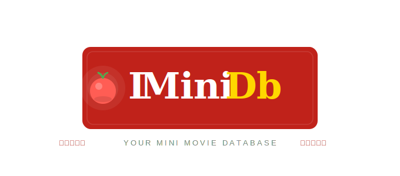

# Funkcionalnosti — IMiniDb



Detaljan pregled svih implementiranih funkcionalnosti projekta.

---

## Registracija i prijava korisnika

Lozinke se nikad ne spremaju kao čisti tekst. Pri registraciji izračunava se **SHA-256 hash** kombinacije lozinke, promjenjive soli i papra:

- **Sol (promjenjiva):** sol = korisničko ime korisnika — za svakog korisnika drugačija, ne sprema se u bazu već se rekonstruira pri svakoj prijavi
- **Papar:** skup tajnih vrijednosti koji se ne sprema nigdje. Pri registraciji se random odabire jedan papar. Pri prijavi aplikacija iterira kroz sve moguće papre i traži podudaranje s hashom iz baze

```
Hash = SHA-256(lozinka + korisničko_ime + papar)
```

---

## Pregled i uvoz filmova (OMDb API)

Aplikacija se spaja na javni REST servis **OMDb API** (`http://www.omdbapi.com/`) i koristi dva resursa:

- **Pretraga** (`?s=pojam&page=1`) — vraća do 10 filmova po stranici s osnovnim podacima
- **Detalji** (`?i=imdbID&plot=full`) — vraća puni zapis filma (redatelj, glumci, žanr, ocjena, nagrade, BoxOffice...)

JSON odgovor se parsira kroz `TJSONObject`, mapira u klasu `Film` i parametriziranim INSERT upitom upisuje u lokalnu MySQL tablicu `Filmovi`. Grid se osvježava nakon svakog upisa.

---

## Automatsko preuzimanje postera (dretve)

Posteri filmova preuzimaju se **paralelno** korištenjem više `TThread` instanci (`TPosterDretva`). Za svaki film bez postera pokreće se zasebna dretva koja:

1. Obavlja HTTP GET zahtjev na URL postera
2. Sprema sliku u `TMemoryStream`
3. Upisuje binarni sadržaj u BLOB polje tablice `Filmovi`

Sekvencijalno preuzimanje 15 postera traje ~30 sekundi. Paralelnim pristupom svodi se na 2-4 sekunde (~10× ubrzanje) jer su HTTP zahtjevi I/O-bound operacije.

UI komponente ažuriraju se sigurno iz dretvi:
- `LabelUkupnoFilmova` — prati progres "Posteri: X/Y" kroz **Queue** metodu (ne-blokirajuće)
- `DBGridFilmoviBaza` — osvježava se po završetku zadnje dretve
- UPDATE upiti nad bazom izvršavaju se kroz **Synchronize** metodu (blokirajuće)

Za zaštitu zajedničkog brojača `FBrojacPostera` koristi se **TCriticalSection** kako bi se spriječio race condition pri paralelnoj inkrementaciji.

---

## Omiljeni filmovi (XML)

Lokalna XML datoteka za upravljanje omiljenim filmovima:

- Čitanje svih filmova i prikaz u `ListView`
- Dodavanje novog filma (naslov, godina, trajanje, opis)
- Brzo dodavanje odabirom filma iz `ComboBox` padajućeg izbornika — podaci se automatski popunjavaju
- Uređivanje odabranog filma uz automatsko ažuriranje XML datoteke
- Brisanje uz potvrdu putem DLL dijaloga (`PrikaziPotvrduBrisanja`)

---

## Watchlista (JSON)

JSON datoteka za praćenje filmova koje želiš pogledati:

- Dodavanje filma s XML liste uz provjeru duplikata
- Uređivanje sadržaja filma na watchlisti
- Čitanje i prikaz svih filmova u `ListView`
- Automatsko spremanje promjena

---

## Recenzije (JSON + baza)

- Unos nove recenzije (film, ocjena putem `TrackBar`-a 1-10, tekst, datum)
- Uređivanje postojeće recenzije
- Provjera duplikata (isti film i isti tekst)
- Pohrana u JSON datoteku (UTF-8) i u MySQL tablicu `recenzije`
- Reset forme nakon uspješnog spremanja

---

## Pregled filmova iz baze

Nad tablicom `Filmovi` podržano je:

- **Sortiranje** po godini izlaska (`ORDER BY godina`) — od najstarijih prema najnovijim
- **Filtriranje** po IMDb ocjeni (`WHERE imdbRating >= 8.0`) — samo visoko ocijenjeni filmovi
- **Izračunato polje** — `SELECT COUNT(*) FROM Filmovi` prikazuje ukupan broj filmova u bazi
- **Lookup polje** — u prikazu recenzija, `korisnik_id` se referencira na tablicu `Korisnik` i prikazuje korisničko ime umjesto brojčanog ID-a

---

## Izvještaji (FastReport)

Izvještaj kreiran pomoću **FastReport** komponente prikazuje korisnike zajedno s njihovim recenzijama u **master-detail** odnosu:

- Master: tablica `Korisnik` (korisničko ime)
- Detail: tablica `Recenzije` (sve recenzije tog korisnika)
- Izvoz u **PDF** (`frxPDFExport1`)

---

## Oscar podaci — REST web servis (Apache ISAPI DLL)

Zasebna aplikacija **Oskari** implementirana je kao **ISAPI DLL** (`Oskari.dll`) i deployirana na lokalni **Apache web poslužitelj** (XAMPP) na portu 80.

Podaci o Oscar nominacijama pohranjeni su u JSON datoteci (`oscar-nominations.json`) koja pokriva cijelu povijest dodjele nagrade od **1927. do 2025. godine** (~245 unosa).

Servis nudi dva resursa:

- `GET /oscars/nominations?year={godina}` — dohvaća sve nominacije za zadanu godinu; vraća JSON array objekata s kategorijom, nominiranim osobama, nazivom filma i informacijom o pobjedi
- `GET /oscars/winners?year={godina}` — dohvaća samo pobjednike za zadanu godinu; filtrira unose gdje je `won = true`

Klijentska aplikacija koristi **TRESTClient**, **TRESTRequest** i **TRESTResponse** komponente za spajanje na servis. Korisnik odabire resurs putem `ComboBox`-a (Nominations / Winners), unosi godinu u `Edit` polje i klikom na gumb dohvaća podatke. Rezultati se prikazuju u **StringGrid**-u na zasebnom prozoru s kolonama: Kategorija, Godina, Nominiran, Film i Pobjednik.

---

## Višejezičnost

Podržani jezici: **Hrvatski** i **Engleski** — prevedeno 5+ dijaloga (Prijava, Registracija, PregledFilmova, Dobrodošli, Recenzija).

Prijevodi su implementirani kroz INI datoteku (`postavke.ini`) u sekcijama `HR` i `ENG`. Jezik se mijenja klikom na gumbe `ButtonHRV` / `ButtonENG` bez izlaska iz aplikacije.

---

## Postavke aplikacije

**INI datoteka** (`postavke.ini`):
- Stilovi komponenti (GroupBox, Button) koji se primjenjuju na sve forme
- Prijevodi VCL elemenata za Hrvatski i Engleski
- Datum zadnje pohrane konfiguracije

**Windows registar** (`HKEY_LOCAL_MACHINE\Software\IMiniDB`):
- Datum i vrijeme prvog pokretanja aplikacije
- Ukupan broj pokretanja aplikacije (`IMiniDB_br_otvaranja`)
- Broj registriranih korisnika (`IMiniDB_korisnika`)

---

## Biblioteke

### Statička biblioteka — `SLib.lib`

Klasa `TOmdbParser`:
- `ParseTrajanje(AnsiString runtime)` — parsira string `"142 min"` u cijeli broj (minute)
- `ParseImdbRating(AnsiString rating)` — parsira string `"8.5"` u decimalni broj uz lokalni decimalni separator

Samostalne funkcije:
- `ShowUpisano(int upisano)` — modalni dijalog s brojem uspješno uvezenih filmova
- `double Radi()` — testna funkcija za provjeru ispravnog linkanja

### Dinamička biblioteka — `dynamic.dll`

Klasa `TStringUtils`:
- `Skrati(std::string tekst, int maxZnakova)` — skraćuje tekst i dodaje `"..."` (koristi se za opis filma — max 150 znakova)
- `LokalniDecimal(std::string vrijednost)` — zamjenjuje točku zarezom (`7.5 → 7,5`) za prikaz u hrvatskom formatu

DLL dijalozi:
- **"O aplikaciji"** (`TFormOAplikaciji`) — prikazuje logo, naziv, verziju, autora i kolegij; otvara se modalno
- **"Potvrda brisanja"** (`PrikaziPotvrduBrisanja`) — Da/Ne dijalog za potvrdu brisanja filma iz XML datoteke

DLL resursi:
- Bitmap resurs — logo aplikacije (`IMiniDb_logo.bmp`, 680×300 px), prikazuje se na formi za prijavu

---

## HTTP klijent — preuzimanje postera

Aplikacija koristi `TNetHTTPClient` komponentu za preuzimanje slika postera filmova s interneta (URL dohvaćen s OMDb API-ja).

**Prikaz tijeka preuzimanja:**
- `ProgressBar1` prikazuje postotak preuzetog sadržaja (0% → 100%)
- `LabelProgres` prikazuje numerički postotak uz progress bar
- Tijek se ažurira u 10 koraka kroz petlju s `Application->ProcessMessages()`

**Ograničenje brzine:**
Korisnik može odabrati brzinu preuzimanja kroz `ComboBoxBrzina`:
- Bez ograničenja — preuzimanje punom brzinom, tijek vidljiv bez odgode
- 256 KB/s — sporo preuzimanje, jasno vidljiv tijek
- 512 KB/s — srednja brzina
- 1 MB/s — brzo ali s vidljivim tokom

Ograničenje se implementira kroz `Sleep()` između koraka progress bara, proporcionalno veličini preuzete slike i odabranoj brzini.

---

## Kriptiranje i dekriptiranje

### Simetrično kriptiranje (AES-256)

Email adresa korisnika šifrira se **AES-256** algoritmom (CBC mod) pri registraciji, prije pohrane u bazu podataka. U bazi se sprema kao `ENC:...` string. Ključ za šifriranje je lozinka korisnika.

Dekriptiranje se vrši pri prikazu korisničkih podataka u formi recenzija i pri generiranju PDF izvještaja.

Bez ispravne lozinke (ključa) dekriptiranje nije moguće.

### Asimetrično kriptiranje (RSA)

Ocjena recenzije (broj 1-10) šifrira se **RSA** algoritmom pri spremanju recenzije u JSON datoteku. U JSON-u se sprema kao `RSA:...` string.

Dekriptiranje se vrši:
- Pri učitavanju recenzije u formu — ocjena se prikazuje u `TrackBar`-u kao originalni broj
- Pri sinkronizaciji JSON-a u bazu — u bazu se upisuje dekriptirana vrijednost kako bi izvještaji i upiti radili ispravno

### Napomena

Lozinke se **ne šifriraju** — koristi se jednosmjerno **hashiranje (SHA-256)** s promjenjivom soli i paprom.

---

[Natrag na README](README.md)
